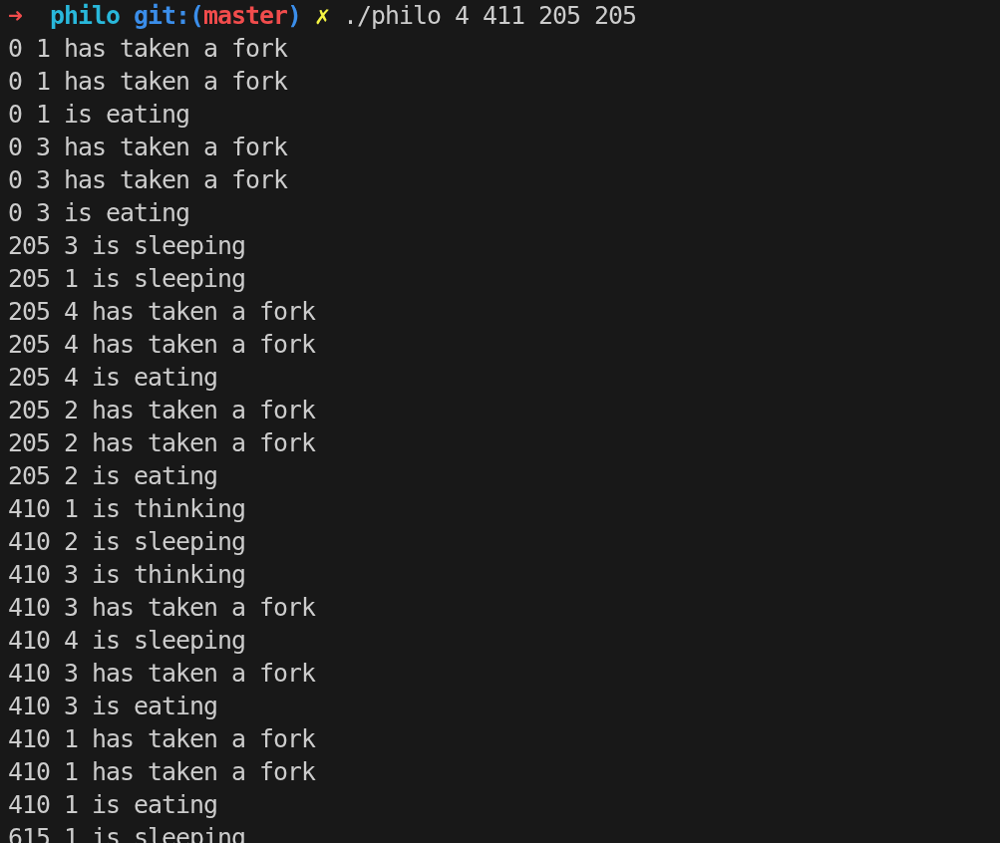

This project has been created as part of the 42 curriculum by moaatik

# Philosophers

A multithreaded simulation of the classic Dining Philosophers problem,
implemented in C as part of the 42 curriculum.

This project explores concurrency, synchronization, and race conditions
using threads and mutexes.

<p align="center">
  
</p>

## About

The Dining Philosophers problem is a classic synchronization problem
that demonstrates the challenges of resource sharing in concurrent systems.

Each philosopher:
- thinks
- eats
- sleeps

But they need two forks (shared resources) to eat,
Each philosopher can take only the fork on his left and the fork on his right,
A Fork can't be used by more that one philosopher in the same time

This project simulates philosophers using threads and ensures proper
synchronization to avoid:
- deadlocks
- race conditions
- starvation

## Features

- Multi-threaded simulation using pthreads
- Mutex-based synchronization
- Deadlock prevention strategies
- Accurate time-based simulation
- Configurable number of philosophers
- Configurable:
  - time to die
  - time to eat
  - time to sleep
  - number of meals (optional)
- Death detection system

## Threads

Each philosopher is represented by a thread:

- pthread_create() → create philosopher thread
- pthread_join() → wait for completion

Threads run concurrently, simulating real parallel execution.

## Mutexes

Mutexes are used to protect shared resources (forks).

Each fork is represented by a mutex:

- pthread_mutex_lock() → take fork
- pthread_mutex_unlock() → release fork

This prevents multiple philosophers from using the same fork at the same time.

## Race Conditions

A race condition occurs when multiple threads access shared data without proper synchronization.

In this project:
- philosophers compete for forks
- shared state (death, eating count) must be protected

## Deadlocks

A deadlock happens when all philosophers hold one fork and wait forever.

Solutions used:
- ordering fork acquisition
- timing strategies
- careful locking logic

## Time Management

The simulation relies on precise timing:

- gettimeofday()
- usleep()

Each philosopher must:
- eat before time_to_die expires

## Scheduling

Each philosopher follows this cycle:

1. take forks
2. eat
3. sleep
4. think

The system ensures fair scheduling to avoid starvation.

## Mandatory (philo)

The mandatory version uses:

- threads (pthread)
- mutexes for forks
- one process per simulation (no fork() processes)

Structure:
- init.c → initialization
- philo.c → main simulation loop
- parsing.c → argument parsing
- utils.c → time + helpers
- more_utils.c → extra utilities

## Bonus (philo_bonus)

The bonus version uses:

- processes instead of threads
- semaphores instead of mutexes

Key differences:
- each philosopher is a process (fork())
- forks are managed with semaphores
- IPC via shared semaphores
- more realistic OS-level simulation

## Processes

In bonus:

- fork() creates a new process per philosopher
- each process runs independently
- parent monitors all children

This simulates OS-level process scheduling.

## Semaphores

Used in bonus instead of mutexes:

- sem_wait() → lock resource
- sem_post() → release resource

Used for:
- forks
- printing synchronization
- death control

## IPC

Since bonus uses processes:

- semaphores are used for communication
- no shared memory races like threads

## Rules

- A philosopher dies if they don’t eat in time
- They must eat before time_to_die expires
- Simulation stops when a philosopher dies or all meals are done

## System Concepts

This project covers:

- pthreads (multithreading)
- mutexes (locking)
- semaphores (IPC)
- processes (fork/kill/wait)
- race conditions
- deadlocks
- starvation
- time scheduling
- resource sharing

## System Calls / Functions

- pthread_create
- pthread_join
- pthread_mutex_init
- pthread_mutex_lock
- pthread_mutex_unlock
- pthread_mutex_destroy
- fork
- waitpid
- kill
- sem_open
- sem_close
- sem_post
- sem_wait
- gettimeofday
- usleep
- malloc
- free

## Example

```bash
./philo 5 650 200 200
```


---

#  Key Learning Outcomes

```md id="p0le19"
- understanding concurrency in C
- avoiding race conditions
- designing thread-safe systems
- handling process synchronization
- mastering low-level timing systems
- learning real OS scheduling behavior
```
